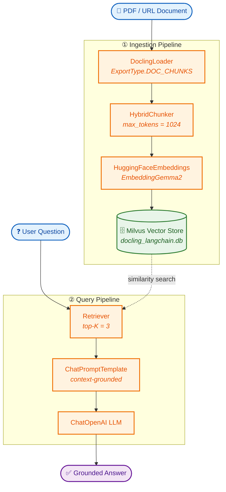

# RAG with LangChain, Docling and LLama-server

A Retrieval-Augmented Generation (RAG) pipeline that ingests documents via [Docling](https://github.com/DS4SD/docling), embeds them with selected Embeddings models, stores vectors in [Milvus](https://milvus.io/), and answers queries using an OpenAI-compatible LLM through LangChain. Llama-server is being used to run a model locally (Qwen3-4B:Q8_0) as it exposes OpenAI compatible endpoint. Thus all of the RAG system runs locally and no private data leaves the laptop/system

---

## Table of Contents

- [Overview](#overview)
- [Features](#features)
- [Architecture](#architecture)
- [Prerequisites](#prerequisites)
- [Installation](#installation)
- [Configuration](#configuration)
- [Usage](#usage)
- [Project Structure](#project-structure)
- [How It Works](#how-it-works)
- [Customization](#customization)
- [Notes](#notes)
- [License](#license)
- [Acknowledgements](#acknowledgements)

---

## System Diagram



## Overview

This project demonstrates a complete RAG workflow using LangChain as the orchestration framework. It loads documents (PDFs by default) with **DoclingLoader**, splits them into semantically meaningful chunks with **HybridChunker**, generates embeddings using a **Transformers** model, stores them in a **Milvus** vector database, and then retrieves relevant context to answer user questions via a **ChatOpenAI** model through Llama-server because Llama-server runs a model locally (Qwen3-4B:Q8_0) and exposes OpenAI compatible endpoint which can be used by anyone to send queries to and get the reply.

The entire pipeline is configurable through a single `config.py` file.

---

## Features

- **Document ingestion with Docling** – uses `DoclingLoader` with `ExportType.DOC_CHUNKS` to extract structured text from PDFs.
- **Hybrid chunking** – applies `HybridChunker` with a tokenizer based on `google/embeddinggemma-2` and a maximum of 1024(configurable) tokens per chunk.
- **HuggingFaceEmbeddings** – generates dense vector representations using `selected Embeddings model`.
- **Milvus vector store** – persists embeddings in a local Milvus database file (`docling_langchain.db`).
- **OpenAI-compatible LLM** – answers questions using `ChatOpenAI` with a custom prompt template that restricts responses to the retrieved context.
- **Configurable via `config.py`** – all key parameters (file path, embedding model, token limit, top-K, etc.) are defined in one place.

---

## Architecture

```text
Document (PDF)
      │
      ▼
DoclingLoader ──► HybridChunker ──► HuggingFaceEmbeddings
      │                                   │
      ▼                                   ▼
   Chunks                            Milvus Vector Store
      │                                   │
      └──────────────► Retrieval ◄────────┘
                           │
                           ▼
                    ChatOpenAI (LLM)
                           │
                           ▼
                        Answer
```

1. **Load** – `DoclingLoader` reads the PDF(s) specified in `FILE_PATH`.
2. **Chunk** – `HybridChunker` splits the document into token-bounded segments.
3. **Embed** – Each chunk is embedded using the model defined in `EMBED_MODEL_ID`.
4. **Store** – Embeddings are persisted in a Milvus collection.
5. **Retrieve** – When a query is received, the top-K similar chunks are fetched.
6. **Generate** – The retrieved context and the user query are passed to the LLM, which produces an answer based solely on the provided context.

---

## Prerequisites

- **Python 3.8+**
- **API keys** (see [Configuration](#configuration)):
  - `HF_TOKEN` – HuggingFace token, if required by the embedding model.
- **Milvus** – the project uses a local file-based Milvus instance, so no separate server is required.
- **Docling** – installs via `requirements.txt`, but external plugins for PDF processing may need additional system libraries.

---

## Installation

```bash
# Clone the repository
git clone https://github.com/wrafique007/Retrieval_Augmented_Generation.git
cd Retrieval_Augmented_Generation/RAG_Langchain

# Install dependencies
pip install -r requirements.txt
```

The `requirements.txt` includes the following packages:

```text
docling
ocrmac
pyobjc-framework-Vision
langchain
langchain-classic
langchain-docling
langchain-huggingface
langchain-milvus
langchain-openai
sentence-transformers
```

> **Note:** `ocrmac` and `pyobjc-framework-Vision` are macOS-specific. On other platforms you may need to replace or omit them.

---

## Configuration

All tunable parameters are defined in `config.py`:

| Variable | Description | Default |
|----------|-------------|---------|
| `HF_TOKEN` | HuggingFace token, loaded from environment or Colab secrets | `None` |
| `FILE_PATH` | List of document paths or URLs to ingest | `["https://arxiv.org/pdf/2408.09869"]` |
| `EMBED_MODEL_ID` | Transformers model for embeddings | `"google/embeddinggemma-2"` |
| `MAX_TOKENS` | Maximum tokens per chunk | `1024` |
| `EXPORT_TYPE` | Docling export type (`DOC_CHUNKS` or `MARKDOWN`) | `ExportType.DOC_CHUNKS` |
| `TOP_K` | Number of chunks retrieved per query | `3` |
| `MILVUS_URI` | Path to the local Milvus database file | `"docling_langchain.db"` |

You can override any of these by editing `config.py` or by setting the corresponding environment variables.

Example `.env` file:

```env
HF_TOKEN=your_huggingface_token
```

---

## Usage

1. **Set your API keys** if they are not already in your environment:

   ```bash
   export HF_TOKEN="your_huggingface_token"
   ```

2. **Run the pipeline**:

   ```bash
   python RAG.py
   ```

   The script will:

   - Load the document(s) from `FILE_PATH`.
   - Chunk them with `HybridChunker`.
   - Generate embeddings and store them in Milvus.
   - Execute the query defined in `QUESTION`.
   - Print the answer generated by the LLM.

   The default question is:

   ```text
   Provide me with the evaluation results and let me know which model have the best score?"
   ```

3. **Customize the query**:

   Edit the `QUESTION` variable at the top of `RAG.py`, or replace it with a user-input loop for interactive Q&A.

Example interactive loop:

```python
while True:
    question = input("Ask a question (or type 'exit'): ")
    if question.lower() == "exit":
        break
    response = retrieval_chain.invoke({"input": question})
    print(response["answer"])
```

---

## Project Structure

```text
RAG_Langchain/
├── RAG.py            # Main pipeline: loading, chunking, embedding, retrieval, generation
├── config.py         # Configuration variables: API keys, model IDs, paths, etc.
└── requirements.txt  # Python dependencies
```

---

## How It Works

1. **Environment setup** – `load_dotenv()` loads variables from a `.env` file, and `TOKENIZERS_PARALLELISM` is disabled to avoid tokenizer warnings.
2. **Prompt template** – a `ChatPromptTemplate` instructs the LLM to answer only from the provided context and to admit when the answer is not in the context.
3. **Tokenizer** – a `HuggingFaceTokenizer` wraps the embedding model’s tokenizer with `max_tokens=MAX_TOKENS`.
4. **PDF conversion** – a `DocumentConverter` is configured with `PdfPipelineOptions` to allow external plugins.
5. **Loading and chunking** – `DoclingLoader` reads the file(s) and applies `HybridChunker`; the result is a list of LangChain `Document` objects.
6. **Embedding and storage** – `HuggingFaceEmbeddings` generates vectors, and `Milvus.from_documents` stores them in a local collection.
7. **Retrieval chain** – `create_retrieval_chain` and `create_stuff_documents_chain` combine the retriever (Milvus) with the LLM to produce an answer from the top-K chunks.

---

## Customization

- **Change the document** – update `FILE_PATH` in `config.py` to point to your own PDF or URL.
- **Switch embedding model** – replace `EMBED_MODEL_ID` with any Transformers model.
- **Use a different LLM** – `ChatOpenAI` can be swapped for any LangChain-compatible chat model, such as `ChatAnthropic` or `Ollama`.
- **Adjust retrieval depth** – modify `TOP_K` to retrieve more or fewer chunks.

---

## Notes

- The default `EXPORT_TYPE` is `DOC_CHUNKS`, which directly yields chunked documents. If you switch to `MARKDOWN`, the script will additionally apply `MarkdownHeaderTextSplitter` to further split the markdown output.
- The local Milvus database file `docling_langchain.db` is created in the working directory. Delete it to start fresh.
- For production use, consider replacing the local file-based Milvus with a server-based Milvus deployment.

---

## License

This project is provided as-is for educational and demonstration purposes. See the repository for any license information.

---

## Acknowledgements

- [Docling](https://github.com/DS4SD/docling) – document parsing and chunking.
- [LangChain](https://www.langchain.com/) – RAG orchestration.
- [Milvus](https://milvus.io/) – vector database.
- [EmbeddingGemma2](https://huggingface.co/google/embeddinggemma-2) – embedding models.
